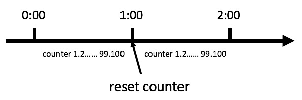
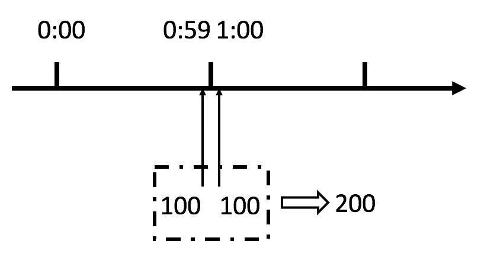
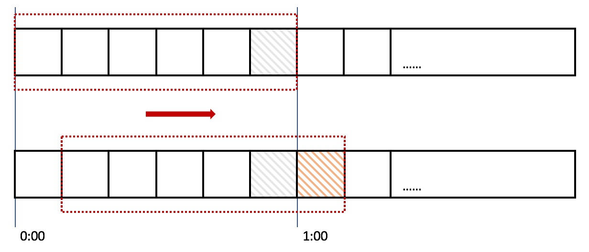
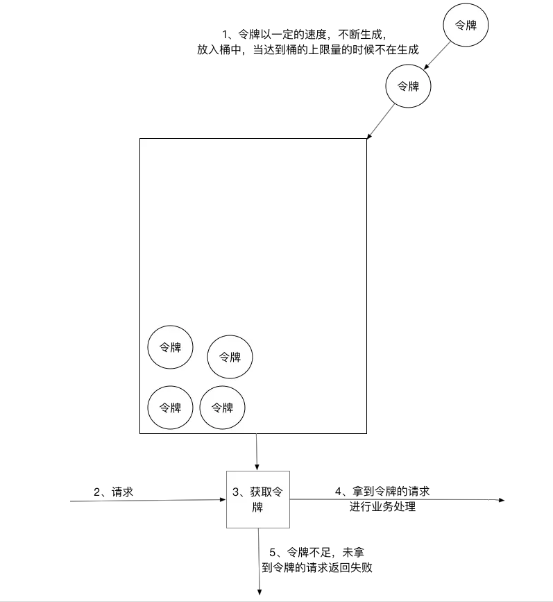
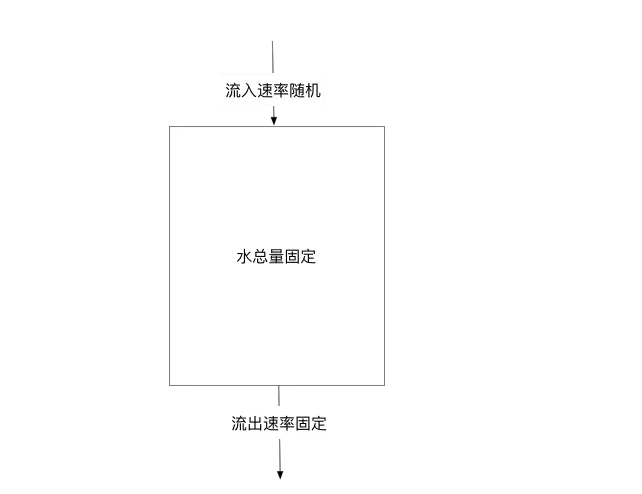

## 限流方法

在开发高并发系统时，有三把利器用来保护系统：缓存、降级和限流。
本篇本章主要介绍常用的限流算法以及他们各自的特点，并通过 JS模拟实现。

### 1. 计数器法

计数器算法是限流算法里最简单也是最容易实现的一种算法。
例如，假设我们规定一分钟内只能访问100次接口 A。当开始接受到请求时，我们初始化一个计数器 `counter = 0` 和 初始时间 `timestamp = +(new Date())`。在往后的一分钟内，每次请求都执行 `counter + 1`，若 counter数值大于限制的100次时，则请求不成功。当请求时间间隔超过一分钟时，则重新初始化 `counter` 和 `timestamp`。



```
class EasyCountLimit {
	constructor(options) {
		this.options = Object.assign({}, {
			interval: 60 * 1000, // 时长默认 1min
			limit: 100, // 规定时长内 限制 100次请求
		}, options)

		this.timestamp = 0
		this.reqCount = 0
	}

	grant() {
		let currentTime = +(new Date())

		if (this.timestamp 
				&& currentTime < this.timestamp + this.options.interval) { // 在时间窗口内
			this.reqCount += 1

			return reqCount <= this.options.limit
		} else {
			this.timestamp = currentTime
			this.reqCount = 1

			return true
		}
	}	
}
```

但这种算法在临界点的时候会出现越界问题。



例如在 0:59发起了100个请求，然后又在 1:00发起100个请求。在临界点前，第一个100请求肯定是满足条件，故请求通过，而后在临界点程序重置了计数器，所以第二个100请求也是满足条件的。这样等价于用户在一秒内请求了200次，很明显这超出了程序的限流作用。

#### 滑动窗口
滑动窗口，又称 rolling window。



在上图中，整个红色的矩形框表示一个时间窗口，在我们的例子中，一个时间窗口就是一分钟。然后我们将时间窗口进行划分，比如图中，我们就将滑动窗口划成了6格，所以每格代表的是10秒钟。每过10秒钟，我们的时间窗口就会往右滑动一格。每一个格子都有自己独立的计数器 `counter`，比如当一个请求 在 0:35秒的时候到达，那么 0:30~0:39 对应的 `counter` 就会加1。
那么滑动窗口怎么解决刚才的临界问题的呢？我们可以看上图，0:59到达的100个请求会落在灰色的格子中，而1:00到达的请求会落在橘黄色的格子中。当时间到达1:00时，我们的窗口会往右移动一格，那么此时时间窗口内的总请求数量一共是200个，超过了限定的100个，所以此时能够检测出来触发了限流。

当分格越细，精度就越高。其实方法1也算是滑动窗口，只是它的窗口分块只有1格，不够细化。

```
class SlidingCountLimit {
	constructor(options) {
		this.options = Object.assign({}, {
			interval: 60 * 1000, // 时长默认 1min
			limit: 100, // 规定时长内 限制 100次请求
			block: 6 // 滑动窗口颗粒度，越小精度越高
		}, options)

		this.timestamp = 0
		this.particleTime = this.options.interval / this.options.block // 每个窗口颗粒的时长
	}

	grant() {
		let currentTime = +(new Date()),
				diffTimestamp = currentTime - this.timestamp - this.options.interval

		if (!this.timestamp // 初始化数据 
				|| diffTimestamp > this.options.interval) { // 滑动窗口在新的时间区域
			this.timestamp = currentTime
			this.countArray = Array(this.options.block).fill(0)
			
			return true
		} else if (diffTimestamp > 0) {
			let particleCount = Math.ceil(diffTimestamp / this.particleTime), // 新的颗粒数目
					particleArr = Array(particleCount).fill(0)
			particleArr.splice(-1, 1, 1) // 滑动窗口的最后一个颗粒 count为 1

			this.timestamp += particleCount * this.particleTime
			this.countArray = [
				...this.countArray.slice(-1 * (this.options.block - particleCount)), 
				...particleArr
			]

			if (this.countArray.reduce((acc, curr) => acc += curr, 0) > this.options.limit) { // 溢出
				this.countArray.splice(-1, 1, 0) // 最后一个颗粒 count值复原

				return false
			}

			return true
		} else { // 当前时间戳在旧的窗口内
			let index = Math.floor(diffTimestamp / this.particleTime) + this.options.block

			// 判断加上当前请求，是否溢出
			if (this.countArray.reduce((acc, curr) => acc += curr, 0) + 1 > this.options.limit) {
		
				return false
			} else {
				this.countArray[index] += 1

				return true
			}
		}
	}
}
```

### 令牌桶算法
令牌桶算法是比较常见的限流算法之一，大概描述如下：
- 所有的请求在处理之前都需要拿到一个可用的令牌才会被处理；
- 根据限流大小，设置按照一定的速率往桶里添加令牌；
- 桶设置最大的放置令牌限制，当桶满时、新添加的令牌就被丢弃或者拒绝；
- 请求达到后首先要获取令牌桶中的令牌，拿着令牌才可以进行其他的业务逻辑，处理完业务逻辑之后，将令牌直接删除；
- 令牌桶有最低限额，当桶中的令牌达到最低限额的时候，请求处理完之后将不会删除令牌，以此保证足够的限流；



```
class TokenLimit {
	constructor(options) {
		this.options = Object.assign({
          upperLimit: 10,
          lowerLimit: 2,
          step: 1,
          interval: 1000
        }, options)
        
		this._tokenAmount = this.options.lowerLimit
		this.tokenFactory()

		// 用于 log令牌数量变化
		Object.defineProperty(this, 'tokenAmount', {
			get: function() {
				return this._tokenAmount
			},
			set: function(v) {
				console.log(`${this._tokenAmount > v : '-' : '+'}, Current token amount: ${v}`)	
				this._tokenAmount = v
			}
		})
	}

	// 隔段时间往桶里加令牌
	tokenFactory() {
		this._interval = setInterval(() => {
			if (this.tokenAmount >= this.options.upperLimit) {
				this.tokenAmount = this.options.upperLimit
			} else {
				this.tokenAmount = this.tokenAmount >= this.options.lowerLimit 
														? this.tokenAmount + this.options.step
														: this.options.lowerLimit
            }
		}, this.options.interval)
	}

	closeTokenFactory() {
		clearInterval(this._interval)
	}

	// 是否允许
	grant() {
		if (this.tokenAmount) {
			this.tokenAmount--

			return true
		}

		return false
	}

	async handle(fn) {
		if (this.grant()) {
			let fnRes = null,
				shouldBackflow = false
			
			// 如果是因为当前 fn而使令牌减少到最低限度，那么完成函数之后需要把令牌还回去
			if (this.tokenAmount < this.options.lowerLimit) {
				shouldBackflow = true
				console.log(`Wrecker: ${String(fn)}`)
			}

			typeof fn == 'function' && (fnRes = await fn())
      
	      if (shouldBackflow) {
	        this.backflow(fnRes)
	      }
		} else {
			console.log(`Wait`)
		}
	}

	backflow(res) {
	    console.log(`Backflow +1, due to ${String(res)}`)
		this.tokenAmount++
	}
}

// TEST
// 第7个是异步操作，而且它使得令牌总量小于 lowerLimit，所以执行完了需要放回令牌
var c = new TokenLimit({
  interval: 1000
})

setTimeout(function() {
  console.log('ST')
  for (var [i, v] of Array(10).entries()) {  
    if (i == 6) {
     c.handle(function () {
      return new Promise((resolve, reject) => {
        setTimeout(() => {
          console.log('SetTimeout...')
          resolve('setTimeout true')
        }, 1500)
      })
     })
    } else {
      c.handle(function () {
        console.log('Normal')
        return true
      })
    }
  }
}, 5000)
```

### 漏桶算法
漏桶算法其实很简单，可以粗略的认为就是注水漏水过程，往桶中以一定速率流出水，以任意速率流入水，当水超过桶流量则丢弃，因为桶容量是不变的，保证了整体的速率。



```
class LeakLimit {
	constructor(options) {
		this.options = Object.assign({
      upperLimit: 100,
      leakCount: 20,
      leakInterval: 1000,
    }, options)
    
    this._pool = []
    Object.defineProperty(this, 'pool', {
      get: function() {
        return this._pool
      },
      set: function(v) {
        this._pool = v
        console.log(`Current pool amount: ${v.length}`)
      }
    })

    this.leakFactory()
  }
  
  leakFactory() {
  	this._leakInterval = setInterval(() => {
  		if (this.pool.length) {
  			let handle = this.pool.shift()

  			console.log(`Handle index: ${handle()}`)
  		}
  	}, this.options.leakCount / this.options.leakInterval)
  }

  closeLeakFactory() {
  	clearInterval(this._leakInterval)
  }

  handle(fn) {
  	if (this.pool.length >= this.options.upperLimit) { // 溢出了
  		console.log(`Overflow handle: ${fn()}`)
  	} else {
  		this.pool.push(fn)
  	}
  }
}

// TEST
// 1-100的会被放桶里，101-200的会被丢弃
var c = new LeakLimit()
for (var i in Array(200).fill(0)) {
  c.handle((i => {
    return function() {
      return i
    }
  })(+i+1))
}
```